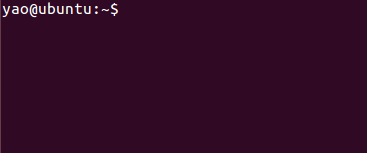

# 一、为什么要学习Linux
想要成为一名合格的程序员，Linux 是必须要点亮的技能树。相比于 Windows 的图形界面，Linux 的命令行虽然看起来枯燥，但它更高效、更稳定，也是互联网大厂服务器的标配。

为了帮大家少走弯路，我特意避开了那些生僻难懂的操作，筛选出了这篇【**Linux基础命令操作大全**】。这里没有复杂的理论，只有让你拿来就能用的干货。建议新手朋友直接收藏，作为案头必备的“作弊小抄”。
# 二、Linux基础命令行
* ls：以平埔的形式，列出当前工作目录的内容

  

* ls /：查看根目录的内容

  

* ls -a：列出以.开头的文件，也就是隐藏文件

  

* ls -l：以列表的形式展示文件，并展示更多细节

  

* ls -lh：-h不能单独使用，需要和-l选项搭配使用，以人性化方式展示文件大小的单位

  

* cd /：切换到根目录

  

* cd：切换到home目录

  

* pwd：得知当前所在目录路径

  

* cd /home/yao/Desktop：（绝对路径）以根目录为起点，描述路径的一种写法，路径描述以/开头

  

* cd Desktop：（相对路径）以当前目录为起点，路径描述无需/开头

  

* cd .. ：表示上一级目录

* cd . ：表示当前目录

* cd ~ ：表示home目录

  

* mkdir mark：在当前目录创建文件夹mark

  

* mkdir -p c/01/02/03：一次性创建多个层级的目录

  

* Ctrl+l：清屏快捷键

  

  
