# 一、为什么要学习Linux
想要成为一名合格的程序员，Linux 是必须要点亮的技能树。相比于 Windows 的图形界面，Linux 的命令行虽然看起来枯燥，但它更高效、更稳定，也是互联网大厂服务器的标配。

为了帮大家少走弯路，我特意避开了那些生僻难懂的操作，筛选出了这篇【**Linux常用基础命令操作大全**】。这里没有复杂的理论，只有让你拿来就能用的干货。建议新手朋友直接收藏，作为案头必备的“作弊小抄”。
# 二、Linux基础命令行
* linux发行版本有很多，但内核只有一个，本次使用的发行版本是ubuntu。

* 快捷键：

  * **ctrl** +**shift** + **=**：放大终端窗口的字体
  * **ctrl** + **-**：缩小终端窗口的字体

* 命令手册：

  * command --help：显示命令的帮助信息

    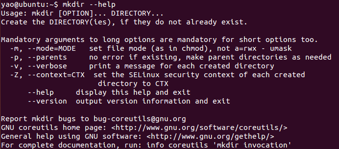

  * man command：man是manual的缩写，是linux提供的手册

    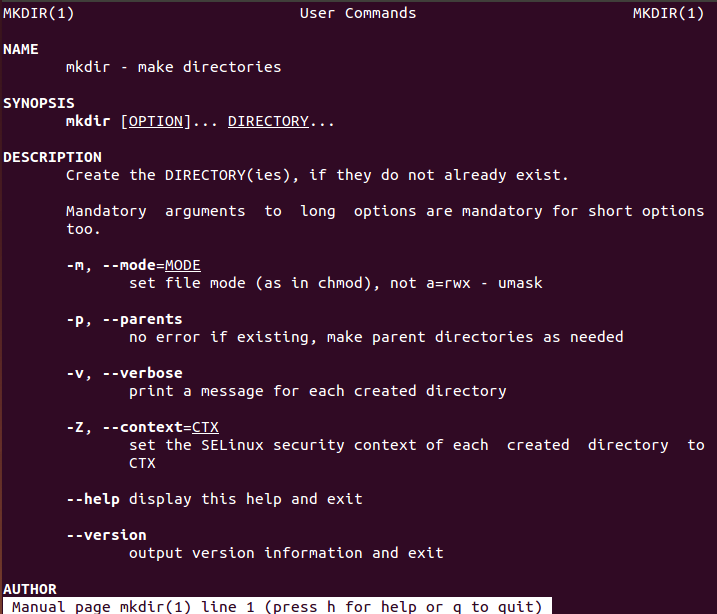

    | **操作键** | **功能**             |
    | ---------- | -------------------- |
    | 空格键     | 显示手册页的下一屏   |
    | Enter键    | 一次滚动手册页的一行 |
    | b          | 回滚一屏             |
    | f          | 前滚一屏             |
    | q          | 退出                 |
    | /word      | 搜索word字符串       |

* ls：以平埔的形式，列出当前工作目录的内容

  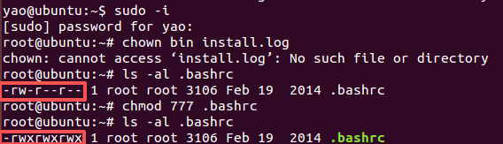

* ls /：查看根目录的内容

  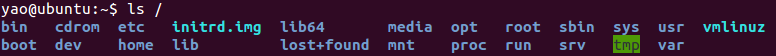

* ls -a：列出以.开头的文件，也就是隐藏文件

  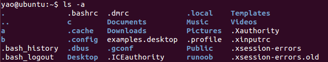

* ls -l：以列表的形式展示文件，并展示更多细节

  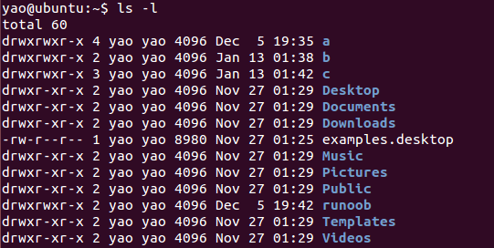

* ls -lh：-h不能单独使用，需要和-l选项搭配使用，以人性化方式展示文件大小的单位

  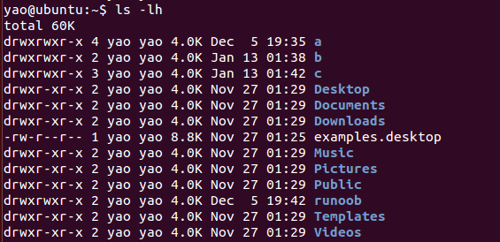

* 通配符：

  * ***：**代表任意多个字符

    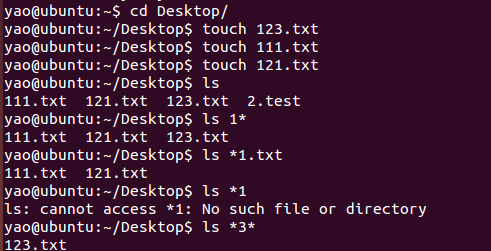

  * **?：**只代表一个字符

    

  * **[]：**表示可以匹配字符中的任意一个

    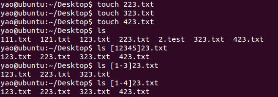

* cd /：切换到根目录

  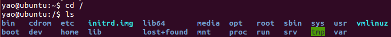

* cd：切换到home目录

  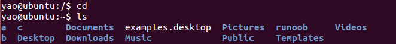

* pwd：得知当前所在目录路径

  

* cd /home/yao/Desktop：（绝对路径）以根目录为起点，描述路径的一种写法，路径描述以/开头

  

* cd Desktop：（相对路径）以当前目录为起点，路径描述无需/开头

  

* cd .. ：表示上一级目录

* cd . ：表示当前目录

* cd ~ ：表示home目录

  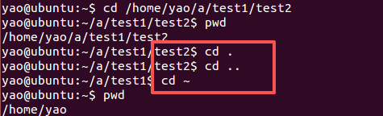

* cd -：在最近的两个目录之间来回切换

  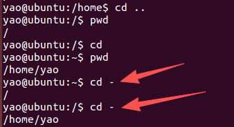

* mkdir mark：在当前目录创建文件夹mark

  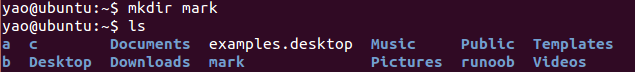

* mkdir -p d/1/2/3/4：一次性创建多个层级的目录

  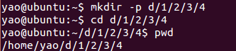

* rm -r 12：删除命名为12的文件夹，删除后不要回复

  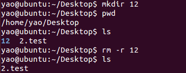

* touch new.test：创建一个新的文件

  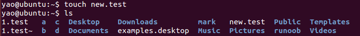

* rm 123.txt：删除名为123.txt的文件，删除后不要回复

  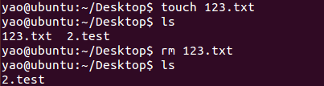

* clear：清屏

* **ctrl**+**l**：清屏快捷键

* cp 1.test 2.test：复制文件，将1.test的内容复制到2.test

  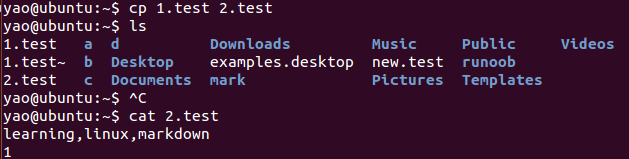

* cp -r a e：复制文件夹，将a文件夹内容复制到e中

  

* cp ~/Documents/readme.txt .：将Documents目录下的readme.txt文件复制到当前目录下，文件名不改变

  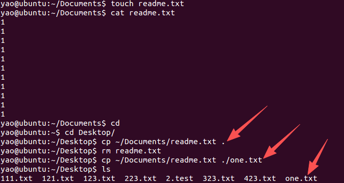

* 如果已经有了文件名，但是复制的文件内容不一样，不想出现如下提示的方法，是cp -i ~/Documents/readme.txt ./one.txt

  * cp ~/Documents/readme.txt ./one.txt的效果

    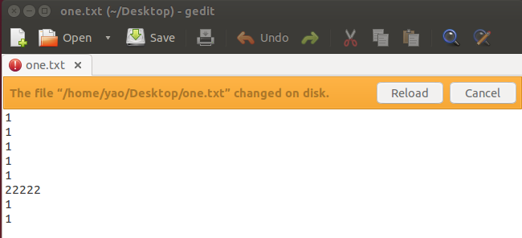.

  * cp -i ~/Documents/readme.txt ./one.txt，回答y/n

    

* tree：树状图列出文件目录格式

  * 需要提前安装tree，执行命令sudo apt-get install tree

  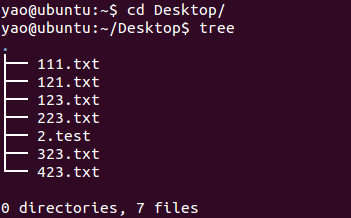

* tree -d：只看目录，不看文件

  

* mv 2.test Desktop/：将Home目录下的2.test文件移动到Desktop中，移动文件夹是一样的操作

  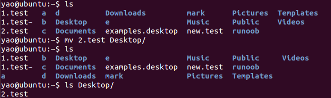

* mv改名，文件内容不变：mv one.txt demo.txt，想要覆盖文件时有提醒，在mv后面加上**-i**即可，会安全一些

  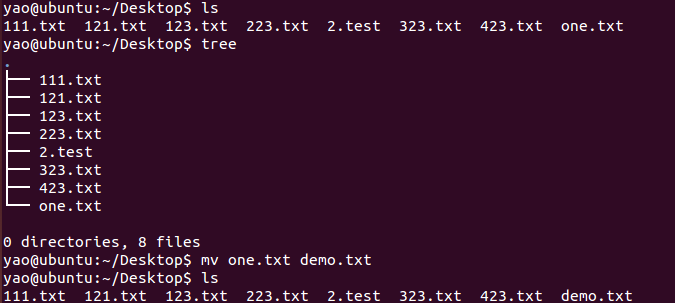

* cat 1.test：查看文件内容，cat -b：空行不会编号，cat -n：都会编号

  

* more /etc/services：查看文件内容，可翻页查看，按【空格】翻页，按【q】退出查看

  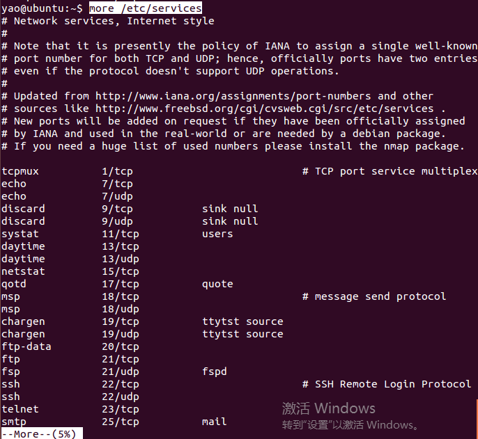

* grep：对文本文件进行模式查找，grep l 2.test：在文件中查找带有l字符的内容

  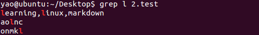

* grep -n l 2.test：带行号查找

  

* grep -v l 2.test：反向查找

  

* grep -ni "hello world" 2.test：忽略大小写查找

  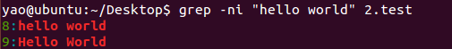

* 

* 

* 

* 

  

  

