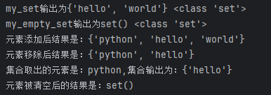
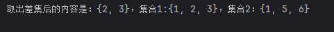
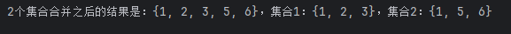
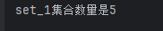

# Python学习回顾（每日更新）

### 第一部分：Python基础与流程控制

1. m.n：m宽度；n精度
案例场景：计算股票收益，要求精确控制小数点位数。
```python
# 表达式格式化：股价计算小程序
name="传智播客"
stock_price=19.99
stock_code="003032"
stock_price_daily_growth_factor=1.2
growth_days=7
finally_stock_price=stock_price*stock_price_daily_growth_factor**growth_days
# 计算：经过growth_days天的增长后，股价达到了多少钱
# 使用字符串格式化进行输出，如果是浮点数，要求小数点精度2位数
print(f"公司：{name},股票代码：{stock_code},当前股价：{stock_price}")
print("每日增长系数是：%s,经过%d天的增长后,股价达到了：%.2f" % (stock_price_daily_growth_factor,growth_days,finally_stock_price))
```
2. if-elif-else组合判断
案例场景：动物园门票判断，身高和会员等级双重校验。
```python
# 判断是否买票
vip_level=3
print("欢迎来到动物园。")
height=int(input("请输入你的身高（cm）："))
vip_level1=int(input("请输入你的会员等级："))
if height>120:
    print(f"您的身高超出{height}cm，游玩需要购票10元。")
elif vip_level1<=vip_level:
    print(f"您的等级不够，游玩需要购票10元")
else:
    print(f"您的身高未超出{height}cm，可以免费游玩。")
print("祝您游玩愉快。")
```
3. While循环入门：累加计算。
```python
# while循环输出1+...100的值
i=1
sum_1=0
while i<=100:
    sum_1 = sum_1 + i
    i=i+1
    print(f"1+...100的值：{sum_1}")
```
4. 互动小游戏：猜数字（无限次机会版）
知识点：random模块与input交互。
```python
"""
设置一个范围1-100的随机整数变量，通过while循坏，配合input语句，判断输入的数字是否等于随机数
1.无限次机会，直到猜中为止
2.每一次猜不中，会提示大了或小了
3.猜完数字后，提示猜了几次
"""
import random
num=random.randint(1,100)
flag=True
count=0
while flag:
    guess_num = int(input("请输入数字："))
    count+=1
    if guess_num==num:
        print("猜测正确")
        flag=False # 结束进程
    else:
        if guess_num>num:
            print("猜测数字过大")
        else:
            print("猜测数字过小")
print(f"总共猜测了{count}次。")
```
5. 经典必练：九九乘法表 (While版)
技巧：注意\t制表符和end=" "不换行的用法。
```python
# 九九乘法表
i=1
# 外层循环，共9行
while i<=9:
    # 内层循环，乘到这一行的行数
    # \t：对齐，end=""：输出不换行，print()：输出一个换行
    j=1
    while j<=i:
        print(f"{j}*{i}={j*i}\t",end="")
        j+=1
    i+=1
    print()
```
6. For循环基础：字符统计
```python
# 判断name中有多少个a
name="itheima is a brand of itcast"
count=0
# x：临时变量，name：被统计的变量
for x in name:
    if x=="a":
        count+=1
print(f"itheima is a brand of itcast中共有：{count}个字母。")
```
7.  Range函数应用：偶数统计器
```python
# 随机生成一个num，看num里有几个偶数
import random
num=random.randint(1,100)
print(num)
count=0
for x in range(1,num):
    if x%2==0 :
        print(f"输出所有的偶数：{x}")
        count+=1
print(f"1到{num}范围内有几个偶数：{count}")
```
8. 经典必练：九九乘法表 (For版)
```python
# for循环九九乘法表
for i in range(1,10):
    for j in range(1,i+1):
        print(f"{j}*{i}={j*i}\t",end="")
    print()
```
9. 综合大作业：企业工资发放系统
实战难点：同时运用continue（跳过）和break（终止）。
场景描述：公司余额1万，发20人工资，绩效分<5不发，余额发完即止。
```python
"""
员工工资发放系统
某公司账户余额1万元，给20名员工发工资
每人1000元，绩效分低于5不发工资
使用continue跳过不合格员工，使用break结束发工资
"""
import random
def distribute_salary():
    """工资发放主函数 - 使用continue和break"""
    # 初始化变量
    account_balance = 10000  # 账户余额（元）
    salary_per_person = 1000  # 每人工资（元）
    total_employees = 20  # 员工总数

    print("=" * 60)
    print("公司工资发放系统".center(60))
    print("=" * 60)
    print(f"初始账户余额: {account_balance}元")
    print(f"员工总数: {total_employees}人")
    print(f"每人工资: {salary_per_person}元")
    print("-" * 60)

    # 统计数据
    paid_count = 0  # 成功发放人数
    failed_count = 0  # 绩效不合格人数

    # 使用for循环依次给员工发工资
    for employee_id in range(1, total_employees + 1):
        # 随机生成员工绩效分(1-10)
        score = random.randint(1, 10)

        # 检查账户余额是否充足 - 使用break直接结束发工资
        if account_balance < salary_per_person:
            print("\n" + "!" * 60)
            print(f"账户余额不足！剩余: {account_balance}元")
            print(f"使用 break 结束发工资流程")
            print("!" * 60)
            break  # 工资发完了，结束发工资

        # 判断绩效分是否合格
        if score < 5:
            # 绩效不合格，不发放工资，使用continue跳过当前员工
            failed_count += 1
            print(f"员工{employee_id:2d}号 | 绩效分: {score:2d} | "
                  f"✗ 绩效不合格(低于5)，使用 continue 跳过 | "
                  f"剩余余额: {account_balance}元")
            continue  # 跳过该员工，换下一位

        # 绩效合格，发放工资
        account_balance -= salary_per_person
        paid_count += 1
        print(f"员工{employee_id:2d}号 | 绩效分: {score:2d} | "
              f"✓ 发放成功 | 发放金额: {salary_per_person}元 | "
              f"剩余余额: {account_balance}元")

    # 打印统计结果
    print("\n" + "=" * 60)
    print("工资发放统计".center(60))
    print("=" * 60)
    print(f"成功发放人数: {paid_count}人")
    print(f"绩效不合格人数: {failed_count}人")
    print(f"未处理人数: {total_employees - paid_count - failed_count}人")
    print(f"总发放金额: {paid_count * salary_per_person}元")
    print(f"剩余账户余额: {account_balance}元")
    print("=" * 60)


if __name__ == "__main__":
    # 运行工资发放程序
    distribute_salary()
```
### 第二部分：Python函数封装与数据容器
1. 函数的基础定义语法案例
```python
# 定义一个函数，省略参数和返回值
def say_hi():
    print("hello world!")
# 调用函数
say_hi()

print("-"*20)
# 带参数
def add(x,y):
    result=x+y
    print(f"数字相加的结果是：{result}")
add(7,8)
```
2. 变量在函数中的作用域
注意：在函数内部修改全局变量，必须声明 global。
```python
# global关键字
num=100
def test_1():
    print(f"test_1的值为：{num}")

def test_2():
    # global关键字：函数内变量为全局变量
    global num
    num=500 # num为局部变量
    print(f"test_2的值为：{num}")

test_1()
test_2()
print(num)
```
3. 进阶大作业：银行ATM系统
需求分析：实现查询、存款、取款、主菜单循环逻辑，包含异常处理和全局变量管理。
```python
"""
定义一个全局变量:money，用来记录银行卡余额(默认5000000)
定义一个全局变量:name，用来记录客户姓名(启动程序时输入)
定义如下的函数:
1.查询余额函数
2.存款函数
3.取款函数
4.主菜单函数
要求:
1.程序启动后要求输入客户姓名
2.查询余额、存款、取款后都会返回主菜单
3.存款、取款后，都应显示一下当前余额
4.客户选择退出或输入错误，程序会退出，否则一直运行
"""
# 全局变量
money = 5000000  # 银行卡余额，默认500万
name = ""  # 客户姓名
def query_balance():
    """查询余额函数"""
    print(f"\n{name}，您好！您的当前余额为：{money}元")
def deposit():
    """存款函数"""
    global money
    amount = input("\n请输入存款金额：")
    try:
        amount = float(amount)
        if amount <= 0:
            print("存款金额必须大于0！")
        else:
            money += amount
            print(f"存款成功！存入{amount}元")
            print(f"当前余额为：{money}元")
    except ValueError:
        print("输入无效，请输入正确的数字！")
def withdraw():
    """取款函数"""
    global money
    amount = input("\n请输入取款金额：")

    try:
        amount = float(amount)
        if amount <= 0:
            print("取款金额必须大于0！")
        elif amount > money:
            print(f"余额不足！当前余额为{money}元")
        else:
            money -= amount
            print(f"取款成功！取出{amount}元")
            print(f"当前余额为：{money}元")
    except ValueError:
        print("输入无效，请输入正确的数字！")
def main_menu():
    """主菜单函数"""
    while True:
        print("\n" + "=" * 40)
        print(f"欢迎{name}使用银行ATM系统")
        print("=" * 40)
        print("1. 查询余额")
        print("2. 存款")
        print("3. 取款")
        print("4. 退出")
        print("=" * 40)

        choice = input("请选择操作(1-4)：")

        if choice == "1":
            query_balance()
        elif choice == "2":
            deposit()
        elif choice == "3":
            withdraw()
        elif choice == "4":
            print(f"\n感谢{name}使用本系统，再见！")
            break
        else:
            print("\n输入错误，程序退出！")
            break
# 程序启动
if __name__ == "__main__":
    name = input("请输入您的姓名：")
    main_menu()
```
* 第二种方法(初学)：
```python
money=5000000
name=input("请输入您的姓名：")
# 查询余额函数
def query(show_header):
    if show_header:
        print("---------------查询余额----------------")
    print(f"{name},您好，您的余额剩余：{money}元")

# 存款函数
def saving_money(num):
    print("---------------存款----------------")
    print(f"{name},您好，您存款{num}元成功")
    global money
    money += num
    query(False)

# 取款函数
def get_money(num):
    print("---------------取款----------------")
    print(f"{name},您好，取款{num}元成功")
    global money
    money -= num
    query(False)
# 主菜单函数
def main():
    print("---------------主菜单----------------")
    print(f"{name}，您好，欢迎来到黑马银行ATM，请选择操作：")
    print("查询余额/t[输入1]")
    print("存款/t/t[输入2]")
    print("取款/t/t[输入3]")
    print("退出/t/t[输入4]")
    return input ("请输入您的选择：")  # 很重要

while True:
    keyboard_input=main()
    if keyboard_input=="1":
        query(True)
        continue   # 通过continue继续下一次循环，一进来就是主菜单
    elif keyboard_input=="2":
        num=int(input("请输入您要存款的金额："))
        saving_money(num)
        continue
    elif keyboard_input=="3":
        num=int(input("请输入您要取款的金额："))
        get_money(num)
        continue
    else:
        print("退出银行系统。")
        break
```
4. 列表的下标索引
索引规则：正向从0开始，逆向从-1开始。
```python
# 列表
my_list=[True,666,"萝卜"]
print(my_list[0])
print(my_list[1])
print(my_list[2])
print(my_list[-1])
print(my_list[-2])
print(my_list[-3])

my_list=[[1,2,3],[4,5,6]]
print(my_list[1][1])
print(my_list[-1][-2])
```
5. 列表的用法（增删改查）
```python
# 列表查询
mylist=["itself","python","hello"]
index=mylist.index("python")
print(f"python的索引位置在：{index}")

# 列表修改元素
mylist[1]="world"
print(f"更改之后的列表：{mylist}")

# 插入列表元素
mylist.insert(1,"best")
print(f"列表插入元素后结果是：{mylist}")

# 追加元素，将元素加入列表最后的位置
mylist.append("last")
print(f"追加元素之后结果是：{mylist}")

# 追加一批元素，将其他数据容器的内容取回粗，依次追加到列表尾部
mylist_1=[1,2,3]
mylist.extend(mylist_1)
print(f"列表追加一个新的列表后结果是：{mylist}")

# 删除元素-------del
del mylist[2]
print(f"列表删除元素后的结果是：{mylist}")

# 删除元素----pop（指定下标将元素剪切走，可以提取剪切的元素）
element=mylist.pop(2)
print(f"移除元素之后的结果是：{mylist}，取出的元素是：{element}")

# 删除元素-----remove，删除列表中从前到后找到的第一个匹配项
mylist=[1,3,"best",5,"best",7,"best",9]
mylist.remove("best")
print(f"使用remove删除元素之后结果是：{mylist}")

# 清空元素
mylist=[1,2,3,4,5,6,7,8]
mylist.clear()
print(f"清空列表之后的结果是：{mylist}")

# 统计某个元素在列表中的数量
mylist=[1,3,"best",5,"best",7,"best",9]
count=mylist.count("best")
print(f"best在列表中的数量是：{count}")

# 统计列表中全部元素数量
num=len(mylist)
print(f"列表中的数量是：{num}")
```
* 列表综合练习题
```python
# 列表练习题
# 定义列表，变量接收
mylist_age=[21,25,21,23,22,20]
# 追加数字31，到列表尾部
mylist_age.append(31)
print(f"追加数字31，到列表尾部结果是：{mylist_age}")
# 追加一个新列表[29,33,30]，到列表尾部
mylist_3=[29,33,30]
mylist_age.extend(mylist_3)
print(f"追加一个新列表[29,33,30]，到列表尾部的结果是:{mylist_age}")
# 取出第一个元素（应是：21）
element_1=mylist_age.pop(0)
print(f"取出第一个元素:{element_1}")
# 取出最后一个元素（应是：30）
element_2=mylist_age.pop(-1)
print(f"取出最后一个元素:{element_2}")
# 查找元素31，在列表中的下标位置
# index=mylist_age.index("31")
# 错误原因：元素类型31是整数，但是双引号标注之后类型变成字符串，因此运行后会显示列表中查找不到
index=mylist_age.index(31)
print(f"查找元素31，在列表中的下标位置是：{index}")
```
6. 列表的遍历与筛选
```python
# 列表的遍历---while循环
def list_while_func():
    my_list=["圣诞节快乐！","元旦快乐！","新年快乐！"]
    # 循环控制变量通过下标索引变量
    index_1 = 0
    while index_1<len(my_list):
        # 循环条件：下标索引变量<列表元素数量
        element=my_list[index_1]
        print(f"列表的元素：{element}")
        index_1 +=1

# 列表的遍历---for循环
def list_for_func():
    my_list=[1,2,3,4,5,6]
    index_2=0
    for element in my_list:
        print(f"列表的元素：{element}")
        element+=1

list_while_func()
print("-"*20)
list_for_func()
```
7. 实战：取出列表中元素的偶数
```python
# 练习案例：取出列表中的偶数--while
def list_mynum():
    my_list = [1, 2, 3, 4, 5, 6, 7, 8, 9, 10]
    num = 0
    while num < len(my_list):
        if my_list[num] % 2 == 0:
            print(f"元素中的偶数是：{my_list[num]}")
        num += 1
list_mynum()
print("-" * 20)

# for循环遍历练习案例
def list_for_mynum():
    my_list = [1, 2, 3, 4, 5, 6, 7, 8, 9, 10]
    for i in my_list:
        if i % 2 == 0:
            print(f"元素中的偶数是：{i}")
        i += 1
list_for_mynum()
```
8. 元组（Tuple）：不可变的列表
特点：一旦定义，不可修改（除了内部嵌套的可变对象）。
```python
# 元组的基本操作
t1=("小红",11,["football","music"])
query=t1.index(11)
print(f"年龄的下标索引是：{query}")
name=t1[0]
print(f"学生的姓名是：{name}")
del t1[2][0]
print(f"删除学生爱好中的football之后的结果是：{t1}")
# list列表可以增加元素，元组不可以对元素进行任何修改，元组t1先索引到list，然后再使用增加函数append()
t1[2].append("coding")
print(f"增加爱好：{t1}")
```
9. 字符串的练习----分割字符串
```python
# 练习案例：分割字符串
my_str="itheima itcast boxuegu"
num=my_str.count("it")
print(f"统计字符串中it字符的数量是：{num}")
my_new_str=my_str.replace(" ","|")
print(f"字符内的空格全部替换成|之后的结果是：{my_new_str}")
list_str=my_new_str.split("|")
print(f"按照|分割后，得到的结果是：{list_str}")
```
10. 数据容器（序列）的切片

    口诀：[起始下标 : 结束下标 : 步长]，左闭右开

    此操作不会影响序列，而会得到一个新的序列

    * 起始可以省略，省略从头开始
    * 结束可以省略，省略到尾结束
    * 步长可以省略，省略步长为1（也可以是复数，表示倒序执行）
```python
# “左闭右开”区间 [start, end)
# 序列[起始:结束:步长]
my_str="万过薪月，员序程马黑来，nohtyP学"
my_new_str=my_str[::-1]
print(f"切片倒序的结果是：{my_new_str}")
new_str=my_new_str[9:-5:]
print(f"切片取出的结果是：{new_str}")
```
11. 数据容器set

    集合：不支持元素的重复（自带去重功能），不支持下标索引，并且内容无序。

    基本语法：

    ```python
    # 定义集合
    my_set={"hello","world","hello","world","hello","world"}
    my_empty_set=set()
    print(f"my_set输出为{my_set}",type(my_set))
    print(f"my_empty_set输出为{my_empty_set}",type(my_empty_set))
    # 添加新元素
    my_set.add("python")
    print(f"元素添加后结果是：{my_set}")
    # 移除元素
    my_set.remove("world")
    print(f"元素移除后结果是：{my_set}")
    # 随机取出元素
    element=my_set.pop()
    print(f"集合取出的元素是：{element},集合输出为：{my_set}")
    # 清空集合
    my_set.clear()
    print(f"元素被清空后的结果是：{my_set}")
    ```

    > 

    取出2个集合的差集：

    * 取出集合1和集合2的差集（集合1有而集合2没有）

    * 结果：得到一个新集合，集合1和集合2不变

      ```python
      # 取出2个集合的元素
      set1={1,2,3}
      set2={1,5,6}
      set3=set1.difference(set2)
      print(f"取出差集后的内容是：{set3}，集合1:{set1}，集合2：{set2}")
      ```

      > 

    消除2个集合的差集：

    * 消除集合1中与集合2相同的元素

    * 集合1被修改，集合2不变

      ```python
      # 消除2个集合的元素
      set1={1,2,3}
      set2={1,5,6}
      set1.difference_update(set2)
      print(f"消除2个集合元素之后，set1结果是：{set1},set2结果是{set2}")
      ```

      > 

    2个集合合并：

    ```python
    # 2个集合合并
    set1={1,2,3}
    set2={1,5,6}
    set3=set1.union(set2)
    print(f"2个集合合并之后的结果是：{set3}，集合1：{set1}，集合2：{set2}")
    ```

    > 

    统计集合元素数量len()

    * 元素有去重的功能，所以只统计不重复元素的数量

    ```python
    # 统计集合元素数量
    set_1={1,2,3,4,5,1,2,3,4,5}
    num=len(set_1)
    print(f"set_1集合数量是{num}")
    ```

    > 


> 本次学习参考视频：
> [黑马程序员](https://www.bilibili.com/video/BV1qW4y1a7fU/?spm_id_from=333.337.search-card.all.click)